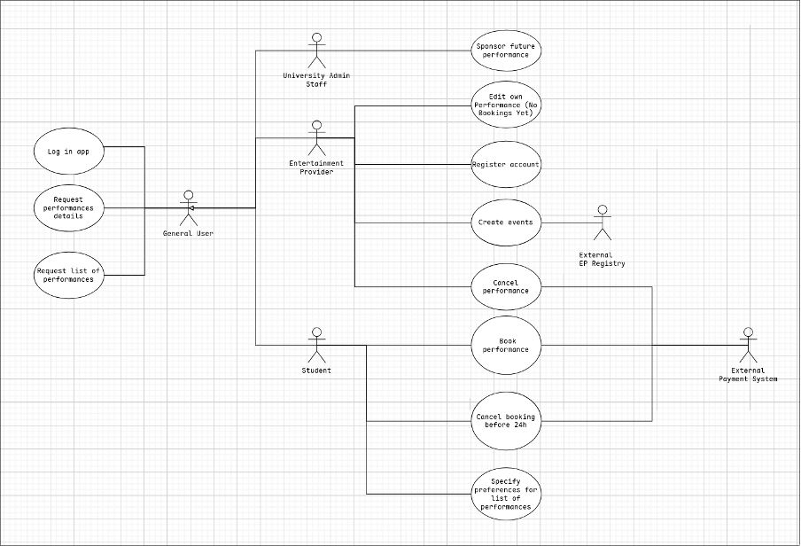

# SEEP CW1

## Task1

Question list

1. What is the ambiguity?
2. If you interviewed a lab demonstrator about this ambiguity, what was the question you asked them regarding it?
3. If you interviewed a lab demonstrator about this ambiguity, what is the exact answer you were given?
4. If the ambiguity was not (fully) addressed by your lab demonstrator interview, or it was not relevant for students, which other stakeholders would you approach and how would you approach them (i.e. what requirements elicitation techniques would you use) to clarify it? In the unavailability of these stakeholders, what assumptions are you making for the purpose of this coursework?

Ambiguities:

1. About Subsidy
   - Q1: We don’t know how to treat the case when university admin staff increase or decrease the sponsors.
   - Q2: Can the sponsor increase or decrease the subsidy?
   - Q3: No, since it's not fair to those students who buy the tickets early.
   - Q4: The lab demonstrator doesn’t address it for us, so our assumption is we assume University admin staff only has one chance to set the sponsors.
   - Demonstrator Answer: So, as a student, I don’t really know the answer to that. I would probably say yes, but unfortunately I can’t give a specific answer.
2. About Tags
   - Q1: What’s the preference system should look like?
   - Q2: Do we need to provide a preference feature when students list all performances? Perhaps the event provider should be required to "tag" performances with a certain amount of relevant keywords from a predetermined list. Students could then select which tags they are interested in and the system would display events in order of number of matching tags?
   - Q3: You would have a preference for that performance, right, and that could be up to three event types, such as music, movies, or sports. You could also choose to have no preferences at all when searching. So that would probably be implemented as a tagging feature.
   - Q4: The Demonstrator agreed to this. We have decided to add this feature in the form of a filter style option that the student can apply when looking through events. The student will be allowed to choose preferred tags and the most relevant activities will be displayed first.
3. About EP’s Editing
   - Q1: We don’t know the editable range of EP
   - Q2: Are EP able to edit all details of the events, such as price, location, time?
   - Q3: EP should only allow editing of a portion of the event information
   - Q4: The demonstrator is not clear on that, we made an assumption that the EP could not change the ticket price
   - Demonstrator Answer: So, as a student, I don’t know the answer to that, but the EP should be able to change the time and the booking date as well. I don’t know the specifics on the other side
4. About Pending Address
   - Q1: We want to know whether the place of a performance could be pending
   - Q2: Can EP give the address of performance as pending status?
   - Q3: We think the address could be pending, as we make assumption that EP could change the location of a performance
   - Q4: The Demonstrator can’t give us an exact answer, we made assumption that this option is available
   - Demonstrator Answer: So I can’t really answer that as a student, because that would be the EP’s responsibility, but I would say that it’s a good idea, yes
5. About reviewing system
   - Q1: How do we design our reviewing system
   - Q2: So for the students’ review part is the rating could be like one to five star or simple like or dislike?
   - Q3: Demonstrator mentioned that an optional review field allowing the student to rate an event from 1-5 and leave a comment would be preferable.
   - Q4: The assumption here is that a review feature would be useful for the students, and so we have included it in our requirements.
6. About Fully Sponsored Performance
   - Q1: We are not sure about the free ticket, does it need to call the external payment system?
   - Q2: For tickets that are fully sponsored (purchased for free), is it still necessary to call an external payment interface, or can the reservation number be issued directly by the App?
   - Q3: We don’t have to call payment system
   - Q4: The Demonstrator is not sure about this, he says that an automatic generated reference seems a good idea, we keep this assumption
   - Demonstrator Answer: So, are you referring to cases where the cost is fully covered by the sponsor? As a student, I am not entirely sure, but it would probably make sense for them to receive an automatic reference. That seems like a good idea.
7. About Privacy
   - Q1: We want find out how much privacy could EP obtain in booking
   - Q2: Can entertainment providers be able to see contact details of audiences?
   - Q3: EP can only obtain email address and names
   - Q4: The Demonstrator is not sure about this, he agreed that only these two are fair, so we keep our assumption.
   - Demonstrator Answer: Again, I can’t answer that, but my preference would be that, if the user gives consent to share other information about themselves, then yes. Otherwise, it should be limited to only their email and their name

    

## Task2

- 

## Task3

### 1a

- Use Case Name: Book performance
- Primary actor: Student
- Supporting actors: External Payment System
- Summary:
  - A student selects a specific event performance and the number of tickets they wish to purchase, completing the transaction through an external payment system.
- Precondition:
  1. The student is logged into the app using their university email and password.
  2. The selected performance must have tickets available
- Trigger: Student selects the option to book a performance after viewing its details
- Guarantee:
  - Success guarantee: A unique booking number is issued, a record containing student contact details is created, and payment is confirmed
  - Failure guarantee: No payment is processed, ticket availability remains unchanged, and no booking record is generated
- Main Success Scenario:
  1. Student chooses the number of tickets they would like to book
  2. System verifies that the requested number does not exceed the tickets remaining for that performance
  3. System redirects the student to the external payment system to handle the financial transaction.
  4. External Payment System processes the payment and notifies the app of a successful transaction
  5. System generates a unique booking number for the student
  6. System creates a booking record including the student’s name, email address, and phone number
  7. System displays the booking confirmation and unique number to the student.
- Extensions:
  1. 2a. The requested number exceeds availability.
     - System informs the student of the remaining capacity and asks for a new quantity.
     - Student enters a valid quantity or cancels

  2. 4a. Payment failure:
     - The external system returns a failure message or the user cancels the payment
     - System Notifies the student that the booking was not successful and no tickets were reserved.

- Use Case Name: Cancel booking
- Primary actor: Student
- Supporting actors: External Payment System
- Summary:
  - A student cancels an existing booking using a booking number, provided the performance is at least 24 hours away. The system processes the cancellation and requests a refund.
- Precondition:
  1. The student is logged into the system
  2. A booking with the given booking number exists.
  3. The performance is at least 24 hours away
- Trigger: The student requests to cancel a booking
- Guarantee:
  - Success: The booking is cancelled and a refund request is sent
  - Failure: The booking remains active

  

- Main Success Scenario:
  1. Student enters a booking number
  2. System verifies that the booking exists and belongs to the student
  3. System checks that the performance is at least 24 hours in the future
  4. System sends a refund request to the External Payment System
  5. External Payment System confirms the refund
  6. System marks the booking as cancelled
  7. System updates ticket availability
  8. System confirms cancellation to the student
- Extension:
  1. 2a. Booking number invalid
     - The System displays an error and ends the use case unsuccessfully
  2. 3a. Less than 24 hours before performance
     - The system denies cancellation and informs the student.

  

### 1b

- Use Case Name: Sponsor future performance
- Primary actor: University Admin Staff
- Supporting actors: None
- Summary: Allow admin staff to authorise and a university-funded discount on any paid performance.
- Precondition:
  1. Admin is logged in
  2. Performance ticket is not free
- Trigger: Admin requires to sponsor an performance
- Guarantee:
  - Success: Ticket price is successfully reduced by designated amount.
  - Failure: Ticket price stays the same
- Main Success Scenario:
  1. Admin enters an amount to reduce by
  2. System requests price of event checks whether this amount is valid
  3. Ticket price is adjusted by the designated amount.
  4. System checks the price of tickets and ensures the change has been made
  5. System sends notice of change to External Payment System
  6. System confirms price reduction to Admin

      

- Extensions:
  1. 2a. Admin enters invalid amount to reduce by.
     - Return to step 1
  2. 4a. Ticket price doesn’t match expected amount
     - Rollack to initial price
     - Display error message
     - Return to step 1

- Use Case Name: Cancel performance
- Primary actor: Entertainment Provider
- Supporting actors: External Payment System
- Summary: An entertainment provider cancels a performance, after which the system prevents further bookings and initiates refunds for existing bookings.
- Precondition:
  1. The EP is logged into the system
  2. The performance exists and belongs to the EP

- Trigger: The EP selects the option to cancel a performance
- Guarantee:
  - Success: The performance is cancelled and refunds are requested
  - Minimal: No new bookings can be made for the performance

- Main Success Scenario:
  1. EP selects one of its performances
  2. System displays performance details
  3. EP requests cancellation
  4. System marks the performance as cancelled
  5. System identifies all related bookings
  6. System requests refunds via the External Payment System
  7. System confirms cancellation to the EP

- Extensions:
  1. 6a. Refund request fails for some bookings
     - System records failed refunds and reports partial success.

### 2a

- Use Case: Create event
- Primary actor: Entertainment Provider
- Supporting actors: None
- Summary: An entertainment provider creates a new event by specifying its title and type. The system records the event and allows the provider to add performances under it.

### 2b

- Use Case: Specify preferences for list of performances
- Primary Actor: Student, Entertainment Provider
- Supporting Actors: None
- Summary: An entertainment provider selects up to 3 tags from a premade list that best match the activity. When viewing the list of performances, the student may select as many tags as desired from a dropdown menu. They then press apply, and the list is sorted by the amount of matching tags, descending. Tags selected by the student may be changed at any time.

- Use Case: Cancel Performance
- Primary Actor: Entertainment Provider
- Supporting Actors: External Payment System
- Summary: While viewing a performance in detail, an entertainment provider will have the option to "cancel" provided they are logged in as the one that originally created the performance. On required input, they are asked to confirm that they wish to cancel the performance. Once confirmed, the system gets details of all bookings already made for the specific event and notifies the payment system to issue the necessary refund(s).

  

## Task 4

1. Use Case Name: Book performance
   1. Security:
      1. The system must ensure that all booking requests are associated with an authenticated student session
      2. The system shall not save student card CVV in the cloud

   2. Robustness:
      1. The system shall ensure that no booking record is created if payment processing fails or times out

2. Use Case Name: Cancel Booking
   1. Security:
      1. The system must verify that the booking number belongs to the requesting student before allowing cancellation

   2. Robustness:
      1. The system shall ensure that a booking remains active if a refund request fails

   3. Usability:
      1. The system shall provide clear feedback explaining why a cancellation request is denied

3. Use Case Name: Specify preferences for list of performances
   1. Accessibility
      1. The system should allow users to change text size/colour when viewing the performance list.
   2. Robustness
      1. The system shall display performances by order of sorting if they have the same amount of matching tags.
   3. Platform Compatibility
      1. The system interface shall scale with the users’ screen size.
   4. Performance
      1. Under normal wifi and database conditions, the system should load all sorted performance entries within 2 seconds of the student pressing "apply".

4. Use Case Name: Create event
   1. Robustness
      1. Event titles with special characters should function normally.
   2. Performance
      1. The system should not create duplicate events from the same request.
   3. Interoperability
      1. The system & other devices should be able to correctly decode the input title.
   4. Usability
      1. Event creation should be intuitive to use by having input labeled for the user, allowing them to create events faster.

5. Use Case Name: Cancel Performance
   1. Robustness
      1. The system should result in either everyone being refunded and the performance cancellation, or the request denied.
      2. While the cancellation is happening, the system should not accept new students booking the event.
   2. Security
      1. The cancellation instruction should be encrypted to prevent eavesdropping.
   3. performance
      1. The cancellation should typically happen within 5 mins of the instruction to prevent students from trying to book the event.
   4. Usability
      1. Performance cancellation should be intuitive to use, while still preventing accidental cancellations.

  

# Task5

## Reflection on teamwork

We initially created a Whatsapp group chat to coordinate the coursework; this worked fine. We then created a shared document on Google Docs which any of us may edit in order to contribute to the tasks. Most communication throughout tasks was done online, and although a decent substitute in the event that a group member can’t make it in person, we reckon more in-person meetings would have been beneficial due to technical difficulties such as issues with mic, poor connectivity, etc. The initial split of work was carried out well and resulted in a fully even split, however in reality this was somewhat ignored and some team members ended up doing more than others. Only two members managed to participate in the in-person interview, which was seen as a substantial contribution by both.

## Reflection on the quality of your work

We have made a strong attempt to meet the requirements set out by the coursework instructions and the marking scheme, to a good amount of success. Two of us have participated in the interview, recording it, which allowed us to obtain accurate information on various ambiguities we discovered beforehand. While we didn't find any ambiguities to add later to the first section, we did try to fully address 7 ambiguities to the best of our ability based on the instructions. Our use case diagram has been designed to cover all the use cases we found, with the diagram allowing us to put into practice the details we have been taught from lectures, allowing us to make a diagram that follows the correct practices. Task 3 has been completed following the instructions for groups of 4, while also following the instruction to follow the format we were presented in tutorial 2. Alongside this, 5 non-functional requirements were listed, with an attempt to cover as many categories for the requirements as we could find.

Overall, the work we did on this coursework has provided various valuable skills for us. The interview gave us insight on how to produce adequate questions to ask, which can be useful in situations where the topic may be something outside of our knowledge. It also gave us knowledge on how to conduct an interview with real stakeholders. Working on the use case diagram allowed us to learn how to utilise our knowledge from the lecture, to use in future situations where we may need to plan similar projects. While there was sufficient work on this document, it may have been improved if each section was split between members instead of entire sections. This way, every member would have gained experience with the interview, or with the UML diagram. Next time, we will also consider the position of the stakeholder to not ask questions they may not be able to answer.

## Reflection on the approach taken

This was a Project-based SE product, although some Product-based methods were used, as not all changes were vetted through the university. Our team adopted Agile process and document-centric approach, using the tutorial 2 template to detail complex use cases. The list of functional requirements was expanded by attempting to clear up ambiguities found throughout the system description, which were subsequently addressed at the student representative interview. Although the representative could not fully address a large amount of queries fully, some of our assumptions proved the need for additional functionality, such as the addition of the review system and adjustments to what an EP may edit about a performance once it is posted. The UML graph was a noticeably useful part of the process as it provided a simple overview of the project actors and use cases, causing it to be easier to perform further tasks, largely further defining non-functional requirements in task 4. This approach was effective for meeting the coursework’s requirements but proved difficult for a member joining late. While we followed the "intern at AcmeCorp" persona to maintain professionalism, the lack of a clear "Coursework manager" role meant that the communication issues wasn’t addressed until it was late. We learned that we need a more agile and inclusive communication style. In the future coursework, we would rotate the "meeting chair" role weekly/daily. This would ensure that one person is always responsible for checking in on everyone’s progress and feelings.
