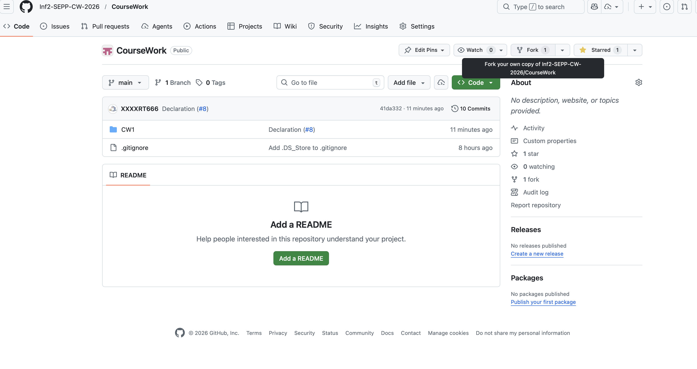

# Contribution Workflow Guide

This document describes the recommended workflow for contributing to the repository using a fork-based model.

Repository URL:
<https://github.com/Inf2-SEPP-CW-2026/CourseWork>

---

## 1. Fork the Repo

- 

## 2. Clone Your Fork

First, clone **your own fork** of the repository:

```bash
git clone https://github.com/<your-username>/CourseWork.git
cd CourseWork
```

---

## 3. Add Upstream Repository

Add the original repository as an upstream remote:

```bash
git remote add upstream https://github.com/Inf2-SEPP-CW-2026/CourseWork.git
git remote -v
```

You should see both `origin` (your fork) and `upstream` (the main repository).

---

## 4. Create and Push a Feature Branch (Optional)

Create a new branch for your work:

```bash
git checkout -b feature/my-change
```

You can also just use `main` branch in local git, if you want to use `main` branch, you can skip the checkout part

Make your changes, then commit them:

```bash
git add .
git commit -m "Describe your changes clearly"
```

Push the branch to your fork:

```bash
git push origin feature/my-change
```

If you use `main` in local git:

```bash
git push origin main
```

---

## 4. Open a Pull Request

1. Go to your fork on GitHub.
2. Click **Compare & pull request**.
3. Ensure the base repository is:
   - `Inf2-SEPP-CW-2026/CourseWork`
4. Ensure the base branch is correct (usually `main`).
5. Submit the pull request.

---

## 5. Squash and Merge

When the pull request is approved:

1. Click **Merge pull request**.
2. Select **Squash and merge**.
3. Confirm the merge.

This keeps the upstream history clean by combining all commits into one.

---

## 6. Continue Using the Same Branch After Merge (Rebase Required)

If you want to **keep using the same local branch** after the PR has been merged, you must rebase it onto the updated upstream branch.

### Step 1: Fetch Latest Changes

```bash
git fetch upstream
```

### Step 2: Rebase Your Branch onto Upstream

Assuming the upstream branch is `main`:

```bash
git checkout feature/my-change
git rebase upstream/main
```

If you use `main` in local git:

```bash
git checkout main
git rebase upstream/main
```

### Step 3: Force Push the Rebasing Result

Because history changed, you must force push:

```bash
git push origin feature/my-change -f
```

If you use `main` in local git:

```bash
git push origin main  -f
```

---

## Notes

- Always rebase on `upstream/main`, not `origin/main`.
- If conflicts occur during rebase, resolve them manually, then continue with:

```bash
git rebase --continue
```

---

End of document.
